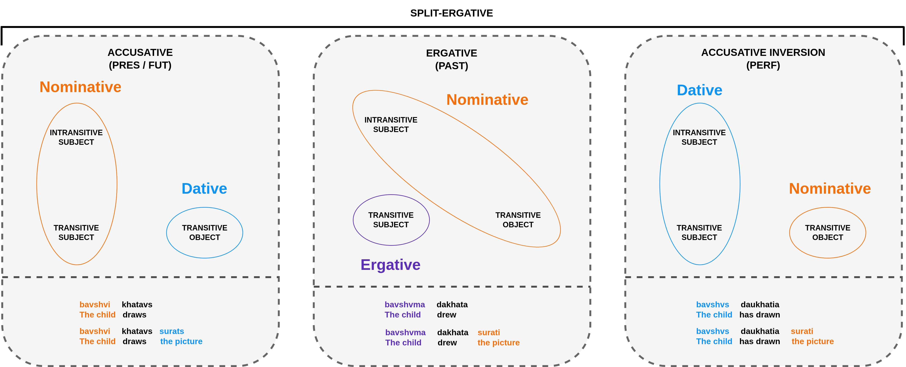

## Targeted Syntactic Evaluation of Georgian Case Alignment

This repository contains the code used to run the evaluations of models on the [Georgian Case Alignment](huggingface.co/datasets/DanielGallagherIRE/georgian-case-alignment) dataset.

